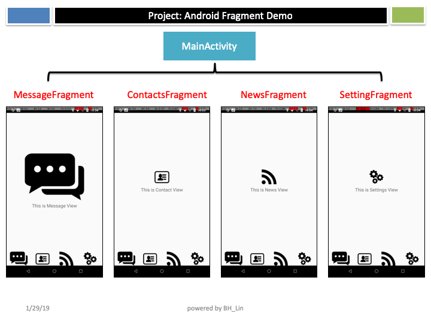
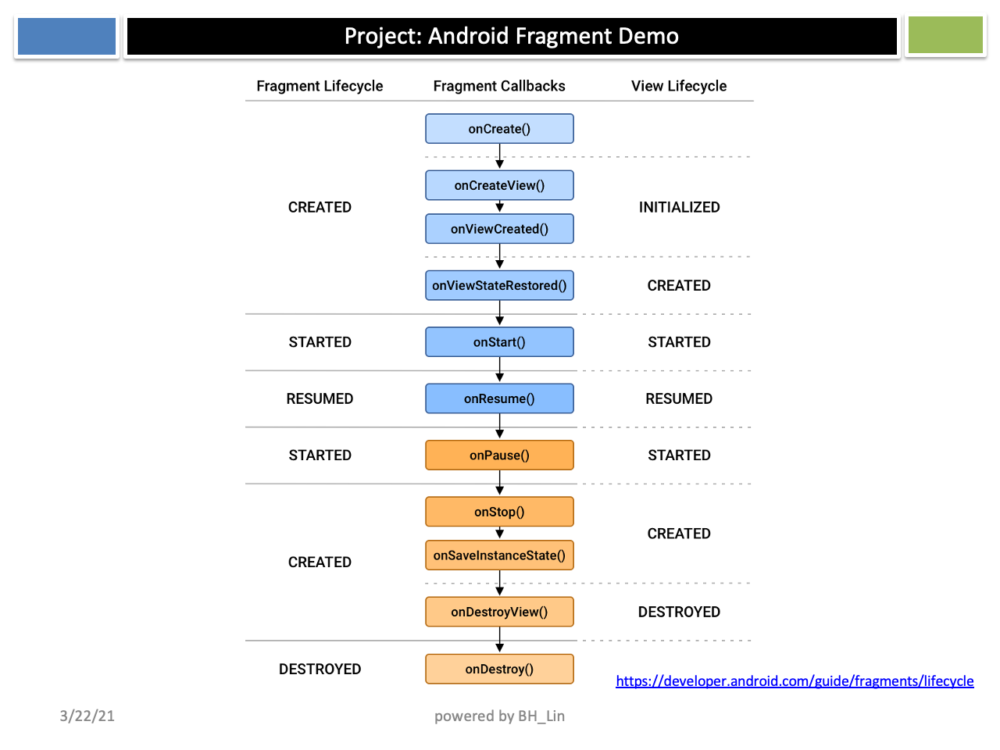
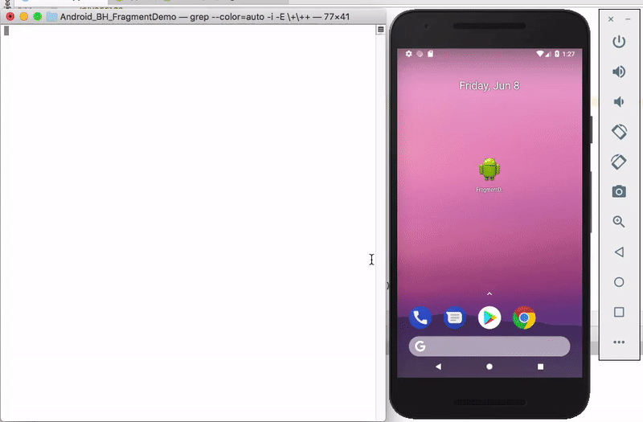

# Android Fragment Demo

This is a simple Android application demonstrating the use of Fragments to create a tabbed layout.

## Features

*   A main activity with a bottom tab bar.
*   Four tabs: Message, Contacts, News, and Setting.
*   Each tab is a separate Fragment.
*   The application logs the lifecycle methods of each Fragment to the console.

## How to Use

1.  Clone the repository.
2.  Open the project in Android Studio.
3.  Run the application on an Android device or emulator.
4.  Click on the tabs to switch between the different Fragments.
5.  Check the Logcat in Android Studio to see the Fragment lifecycle logs.

## Project Structure

*   `MainActivity.java`: The main activity that hosts the Fragments.
*   `MessageFragment.java`: The Fragment for the "Message" tab.
*   `ContactsFragment.java`: The Fragment for the "Contacts" tab.
*   `NewsFragment.java`: The Fragment for the "News" tab.
*   `SettingFragment.java`: The Fragment for the "Setting" tab.
*   `activity_main.xml`: The layout file for the main activity, including the tab bar.
*   `message_layout.xml`, `contacts_layout.xml`, `news_layout.xml`, `setting_layout.xml`: The layout files for each Fragment.

#### Reference: <http://blog.csdn.net/guolin_blog/article/details/13171191>  
  
  
  